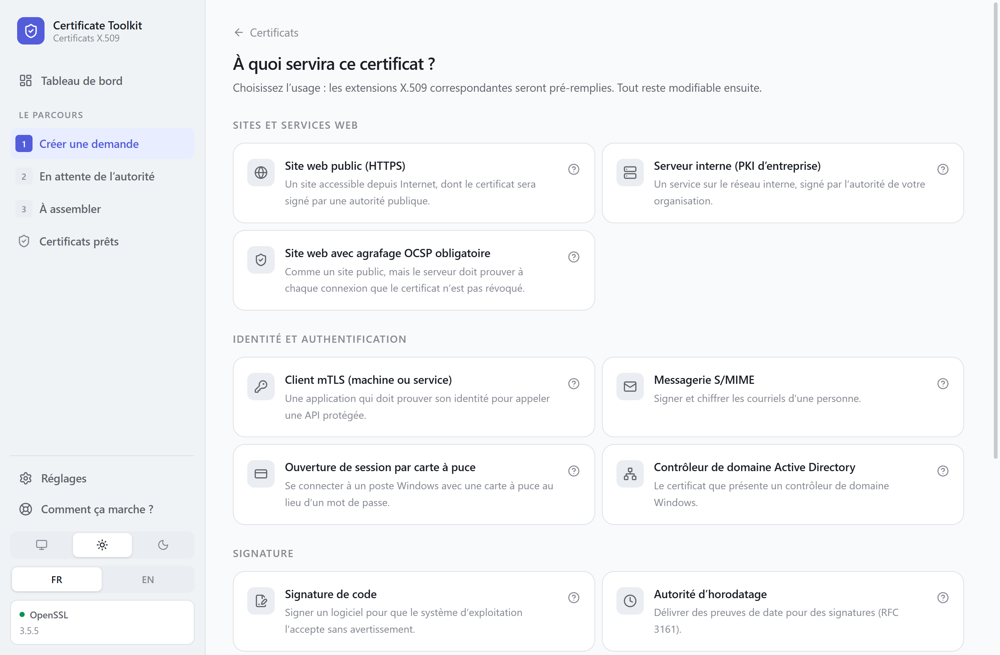

# Modèles

Un modèle traduit un besoin exprimé en français en un jeu d'extensions X.509
correct. Vous choisissez l'usage, l'outil remplit le reste.

Tout reste modifiable ensuite en mode avancé.

## Comment choisir

| Votre situation | Le modèle |
|---|---|
| Un site accessible depuis Internet | Site web public |
| Un service sur le réseau interne | Serveur interne |
| Une application qui appelle une API protégée | Client mTLS |
| Signer et chiffrer les courriels d'une personne | Messagerie S/MIME |
| Se connecter à Windows avec une carte à puce | Ouverture de session par carte à puce |
| Un contrôleur de domaine Windows | Contrôleur de domaine Active Directory |
| Signer un logiciel | Signature de code |
| Un tunnel VPN | Passerelle VPN IPsec |
| Créer une autorité subordonnée | Autorité de certification intermédiaire |
| Reproduire un profil imposé par votre PKI | Personnalisé |

## Ce que chaque modèle met dans le certificat

| Modèle | Usages étendus | Clé | SAN |
|---|---|---|---|
| Site web public | serverAuth | RSA 2048 | DNS, obligatoire |
| Serveur interne | serverAuth, clientAuth | RSA 2048 | DNS et IP, obligatoire |
| Site web avec agrafage OCSP | serverAuth | RSA 2048 | DNS, obligatoire |
| Client mTLS | clientAuth | EC prime256v1 | facultatif |
| Messagerie S/MIME | emailProtection | RSA 3072 | email, obligatoire |
| Carte à puce | clientAuth, Smartcard Logon | RSA 2048 | UPN, obligatoire |
| Contrôleur de domaine | serverAuth, clientAuth, KDC | RSA 2048 | DNS, obligatoire |
| Signature de code | codeSigning | RSA 3072 | facultatif |
| Autorité d'horodatage | timeStamping, critique | RSA 3072 | facultatif |
| Passerelle VPN IPsec | serverAuth, clientAuth, IPsec IKE | RSA 2048 | DNS et IP, obligatoire |
| Autorité intermédiaire | aucun | RSA 4096, SHA-384 | facultatif |
| Personnalisé | aucun | RSA 2048 | tous types |

## Les particularités qui comptent

### Site web public : serverAuth seul

Depuis juin 2026, le CA/Browser Forum interdit qu'un certificat TLS public
porte `clientAuth` en plus de `serverAuth`. Une autorité publique refusera une
demande qui les combine.

Si vous avez besoin des deux, prenez **Serveur interne** ou demandez deux
certificats.

Les validités publiques descendent par ailleurs à 200 jours en 2026, puis 100
en 2027. Prévoyez un renouvellement automatisé.

### Serveur interne : les règles publiques ne s'appliquent pas

Une autorité privée accepte les adresses IP et les noms non publics comme
`app.interne.local`. Le double usage serveur et client y est courant, pour le
mTLS.

### Messagerie S/MIME : le nom n'est pas le SAN

Le Common Name porte le nom de la personne, mais les clients de messagerie ne
le lisent pas. C'est le SAN de type email qu'ils vérifient. Le modèle l'exige
pour cette raison.

### Carte à puce : sans UPN, rien ne fonctionne

Le SAN doit contenir l'UPN du compte Active Directory sous la forme
`jdupont@exemple.local`. Sans lui, le contrôleur de domaine refuse l'ouverture
de session, généralement sans message explicite.

### Contrôleur de domaine : le nom du domaine aussi

Le SAN doit porter le nom DNS complet du domaine, pas seulement celui du
contrôleur. Faute de quoi l'ouverture de session par carte à puce échoue avec
l'événement KDC 29.

### Signature de code : la clé logicielle ne suffit plus

Les autorités publiques imposent aujourd'hui que la clé vive dans un module
matériel, HSM ou token. Une clé générée sur un poste sera refusée. Vérifiez
leurs conditions avant de générer.

### Autorité d'horodatage : usage critique et unique

La RFC 3161 l'exige. Sans cela, les vérificateurs rejettent les jetons produits.

### Autorité intermédiaire : chiffrez la clé

`CA:TRUE` avec une profondeur de 0, ce qui empêche la création d'une
sous-autorité et limite les dégâts en cas de compromission.

Une clé d'autorité compromise compromet tout ce qu'elle a signé. Cochez le
chiffrement de la clé, ou générez-la dans un HSM.

## Modifier ce qu'un modèle a rempli

Basculez sur **Avancé** dans l'en-tête du formulaire. Le sujet complet, toutes
les extensions et les attributs de la demande deviennent modifiables.

Les contrôles restent actifs et signalent les incohérences, y compris celles
que vous introduisez vous-même.
