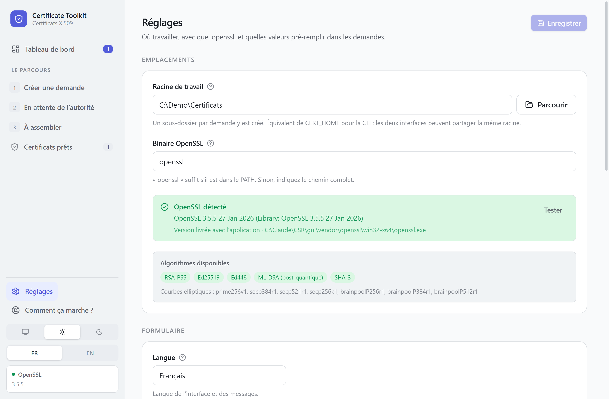

# Réglages

Accessibles par **Réglages** dans la barre de gauche. Rien de secret n'y est
enregistré : ni mot de passe de PFX, ni phrase secrète de clé.

Le fichier se trouve dans `%APPDATA%\Certificate Toolkit\settings.json`. Les
versions portable et installée en ont chacune un.

## Emplacements

**Racine de travail**
Le dossier qui reçoit un sous-dossier par demande. Se change aussi depuis le
bandeau en haut de la liste, ce qui est plus rapide.

Évitez un dossier synchronisé. Une clé privée déposée dans OneDrive part dans
le cloud à la seconde où elle est créée.

**Binaire OpenSSL**
Laissez `openssl` pour utiliser la copie livrée avec l'application. Indiquez un
chemin complet seulement si votre organisation impose un binaire précis.

L'ordre de préférence est : chemin saisi ici, puis copie embarquée, puis
`PATH` du système.

La ligne sous le diagnostic indique laquelle est effectivement utilisée.

## Formulaire

**Langue**
Français ou anglais. Le changement est immédiat et ne touche que l'affichage.
Se change aussi depuis la barre de gauche, sous le thème.

**Ouvrir les demandes en mode avancé**
Affiche d'emblée le sujet complet, les extensions X.509 et les attributs de la
demande. À cocher si vous connaissez X.509 et trouvez le mode simple limitant.

## Valeurs par défaut du sujet

Pré-remplissent chaque nouvelle demande. **Aucune n'est renseignée au premier
lancement**, pas même le pays : les formulaires n'affichent que des exemples
grisés. Mettez-y celles de votre organisation une fois pour toutes, et elles
apparaîtront dans chaque demande.

| Champ | Exemple |
|---|---|
| Pays (C) | `FR` |
| Région ou État (ST) | `Île-de-France` |
| Ville (L) | `Paris` |
| Organisation (O) | `Ma Société` |
| Unité (OU) | `Direction des systèmes d'information` |
| Email | `pki@exemple.fr` |

Chaque demande reste modifiable individuellement.

## Variables d'environnement

Lues au premier lancement, quand aucun réglage n'est encore enregistré. Utiles
pour préconfigurer des postes.

| Variable | Effet |
|---|---|
| `CERT_HOME` | Racine de travail |
| `CERT_COUNTRY` | Pays par défaut |
| `CERT_STATE` | Région par défaut |
| `CERT_LOCALITY` | Ville par défaut |
| `CERT_ORG` | Organisation par défaut |
| `CERT_OU` | Unité par défaut |
| `CERT_EMAIL` | Email par défaut |
| `OPENSSL_BIN` | Chemin du binaire OpenSSL |

Une fois les réglages enregistrés, ce sont eux qui font foi.

Les scripts en ligne de commande lisent les mêmes variables, plus
`PFX_PASSWORD` et `KEY_PASSWORD`. Voir [Scripts](cli.md).

## Vérification des versions

**Décochée par défaut, et rien ne part tant qu'elle l'est.**

Cochée, l'application lit une fois au démarrage le numéro de la dernière version
publiée. Si elle est plus récente que la vôtre, un bandeau vous propose un lien.

Ce qui part : une requête, sans identifiant, sans cookie. Ce qui revient : un
numéro de version. Rien n'est téléchargé ni installé, et l'application n'ouvrira
dans votre navigateur que les pages du projet.

À cocher si votre poste a un accès Internet et que vous voulez être prévenu
d'une correction. À laisser décochée sinon : l'application fonctionne
identiquement.

## Journal

Quand une commande échoue, la raison est écrite dans `journal.log`, dans le
dossier applicatif. Le bouton **Ouvrir le journal** l'affiche, et son chemin
complet est écrit à côté pour que vous puissiez le transmettre.

Le fichier contient la commande lancée, son code de retour et son message
d'erreur. Il ne contient **jamais** de clé privée, de certificat ni de mot de
passe. Seuls les échecs y sont consignés : tant que tout va bien, il est vide.

Il tourne à 1 Mo, et une seule génération précédente est conservée.

## Thème

Système, clair ou sombre, en bas de la barre de gauche. Le choix est enregistré
dans le navigateur intégré, pas dans le fichier de réglages.
